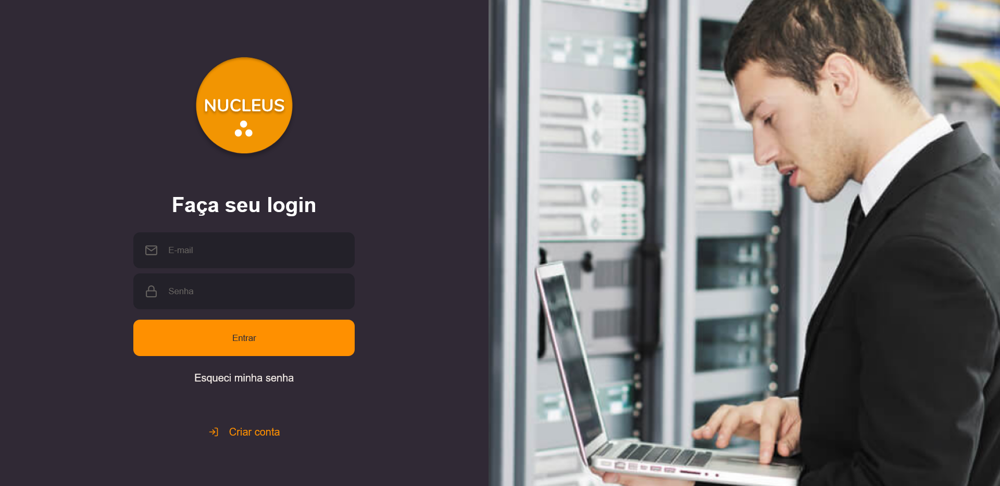

O objetivo deste trabalho é apresentar um projeto de software para o segmento de tecnologia da informação onde os usuários, gestores e técnicos possam registrar e acompanhar o cadastro dos equipamentos de TI, chamados abertos, em andamento, finalizados e relatórios gerenciais.

